### Software Engineer • Azure Data Engineer • AI Builder

 

  

---

# About Me

I'm **Pasupuleti Yashwanth**, a Software Engineer passionate about building scalable, secure, and enterprise-grade software.

## 🚀 Current Focus

- 🌩 Learning Azure Data Engineering
- 🤖 Exploring Artificial Intelligence
- 💻 Building Enterprise SaaS Applications
- 📊 Data Engineering & Cloud Computing
- 🔧 Backend Development
- 🌱 Open Source Contributions

---

# Tech Stack

### Languages

### Frontend

### Backend

### Database

### Cloud & DevOps

---

## GitHub Statistics

---

### "Engineering is about solving problems that scale."

